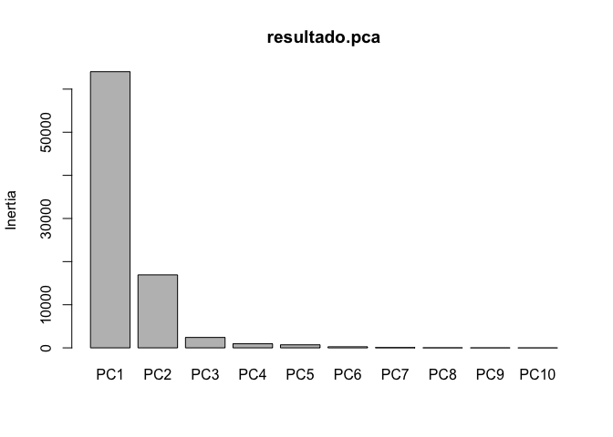

PCA
================

[Link do site que encontrei o
exemplo](https://sites.google.com/site/tutorialdeanalisesestatisticas/topicos/estatistica-multivariada/analise-de-componentes-principais-pca/tutorial-1-1)

Carregando o pacote vegan que possui a função para gerar a PCA

``` r
library(vegan)
```

Carregando a planilha de dados

``` r
dados<-read.table("sedimento.txt",header=T)
head(dados)
```

    ##      N    P     K    Ca    Mg    S    Al   Fe    Mn   Zn  Mo  pH  Cd
    ## 1 19.8 42.1 139.9 519.4  90.0 32.3  39.0 40.9  58.1  4.5 0.3 2.7 2.2
    ## 2 13.4 39.1 167.3 356.7  70.7 35.2  88.1 39.0  52.4  5.4 0.3 2.8 2.2
    ## 3 20.2 67.7 207.1 973.3 209.1 58.1 138.0 35.4  32.1 16.8 0.8 3.0 2.0
    ## 4 20.6 60.8 233.7 834.0 127.2 40.7  15.4  4.4 132.0 10.7 0.2 2.8 2.9
    ## 5 23.8 54.5 180.6 777.0 125.8 39.5  24.2  3.0  50.1  6.6 0.3 2.7 3.0
    ## 6 22.8 40.9 171.4 691.8 151.4 40.8 104.8 17.6  43.6  9.1 0.4 2.7 3.8

Sumarizando o conjunto de dados

``` r
summary(dados)
```

    ##        N               P               K               Ca        
    ##  Min.   :13.40   Min.   :22.70   Min.   : 43.6   Min.   : 188.5  
    ##  1st Qu.:18.82   1st Qu.:32.60   1st Qu.:127.2   1st Qu.: 425.7  
    ##  Median :22.05   Median :41.50   Median :166.6   Median : 518.5  
    ##  Mean   :22.38   Mean   :45.08   Mean   :162.9   Mean   : 569.7  
    ##  3rd Qu.:26.30   3rd Qu.:57.05   3rd Qu.:205.8   3rd Qu.: 739.2  
    ##  Max.   :33.10   Max.   :73.50   Max.   :313.8   Max.   :1169.7  
    ##        Mg               S               Al              Fe         
    ##  Min.   : 25.70   Min.   :14.90   Min.   : 12.1   Min.   :  2.300  
    ##  1st Qu.: 60.90   1st Qu.:29.43   1st Qu.: 38.2   1st Qu.:  5.575  
    ##  Median : 75.05   Median :36.25   Median :106.8   Median : 27.800  
    ##  Mean   : 87.46   Mean   :37.19   Mean   :142.5   Mean   : 49.612  
    ##  3rd Qu.:108.70   3rd Qu.:43.60   3rd Qu.:233.7   3rd Qu.: 85.150  
    ##  Max.   :209.10   Max.   :60.20   Max.   :435.1   Max.   :204.400  
    ##        Mn               Zn               Mo               pH       
    ##  Min.   : 10.10   Min.   : 2.600   Min.   :0.0500   Min.   :2.700  
    ##  1st Qu.: 26.70   1st Qu.: 5.375   1st Qu.:0.2750   1st Qu.:2.800  
    ##  Median : 36.55   Median : 8.100   Median :0.3000   Median :2.900  
    ##  Mean   : 49.33   Mean   : 7.596   Mean   :0.3958   Mean   :2.933  
    ##  3rd Qu.: 59.00   3rd Qu.: 9.100   3rd Qu.:0.5000   3rd Qu.:3.000  
    ##  Max.   :132.00   Max.   :16.800   Max.   :1.1000   Max.   :3.600  
    ##        Cd       
    ##  Min.   :1.000  
    ##  1st Qu.:1.800  
    ##  Median :2.200  
    ##  Mean   :2.200  
    ##  3rd Qu.:2.625  
    ##  Max.   :3.800

### Gerando a PCA com os Valores originais

Execultando a função “prcomp” que calcula a PCA

``` r
resultado.pca <- prcomp(dados)
```

Mostrando os resultados

``` r
resultado.pca
```

    ## Standard deviations (1, .., p=13):
    ##  [1] 253.06973526 130.10611454  49.12035373  30.75833458  26.54022011
    ##  [6]  15.75773932   8.10507247   4.81899637   3.15524852   1.40661321
    ## [11]   0.40639693   0.12130999   0.07878356
    ## 
    ## Rotation (n x k) = (13 x 13):
    ##              PC1           PC2          PC3           PC4          PC5
    ## N   5.709238e-03 -0.0039046209 -0.010041744  0.0632808306 -0.008994820
    ## P  -4.339614e-02  0.0295580844 -0.094212847  0.0197893894  0.067874593
    ## K  -1.725530e-01  0.1634192244 -0.860585661  0.0292682807 -0.141272641
    ## Ca -9.592265e-01  0.1288386958  0.216141815  0.0061317678  0.118330732
    ## Mg -1.300621e-01  0.0377972764 -0.043671629  0.0478401323 -0.851549601
    ## S  -2.445775e-02  0.0467454110 -0.117686268 -0.0609820654 -0.095062268
    ## Al  1.320988e-01  0.9003463609  0.020979868 -0.3242969429  0.128567895
    ## Fe  9.419978e-02  0.3657408759  0.190020028  0.8705611694 -0.091981199
    ## Mn -6.550304e-02 -0.0882540615 -0.388874559  0.3538317686  0.449232768
    ## Zn -8.059252e-03  0.0027094064 -0.011873912 -0.0212295587 -0.018565160
    ## Mo  1.699676e-04  0.0008203904 -0.000637647 -0.0028981900 -0.001020683
    ## pH -2.695246e-05  0.0007213907  0.002619585  0.0003554098  0.001940886
    ## Cd -7.675892e-04 -0.0021867922 -0.004628332  0.0008932363 -0.005353152
    ##              PC6           PC7           PC8           PC9          PC10
    ## N   0.0262647222  0.2000440847  0.9486982391  0.1990416625 -1.221561e-01
    ## P   0.1736285862 -0.9008085589  0.2406025506 -0.2880048907 -2.945843e-02
    ## K  -0.4191935381  0.0356751091  0.0106243557 -0.0651164707  2.683307e-02
    ## Ca -0.0395331477  0.0231133928  0.0007422081  0.0202969522 -4.198623e-03
    ## Mg  0.4757224201  0.0813301752 -0.0132624557 -0.1379187509 -6.192098e-03
    ## S   0.1157497489 -0.2918566008 -0.1556533803  0.8942224622 -2.150968e-01
    ## Al  0.2019339349  0.0811493911  0.0127760415 -0.0473923232 -3.298234e-03
    ## Fe -0.2096355444 -0.0718581004 -0.0448627632  0.0585206513  1.771694e-02
    ## Mn  0.6810148357  0.1972241564 -0.0813181449 -0.0158611071 -3.978526e-03
    ## Zn  0.0591435330 -0.0636121142  0.0934558907  0.2187195539  9.518252e-01
    ## Mo  0.0062664795 -0.0065188137  0.0038829836  0.0136471015 -9.768175e-05
    ## pH -0.0008173176  0.0009729835  0.0039368068 -0.0134620713  2.518032e-02
    ## Cd  0.0111303516  0.0137247330 -0.0034137111 -0.0003117461 -1.738437e-01
    ##             PC11          PC12          PC13
    ## N  -0.0219624402 -0.0003717422  0.0028184840
    ## P   0.0056502395  0.0042806575  0.0033249660
    ## K   0.0047120429 -0.0014717493 -0.0019985952
    ## Ca  0.0007785873 -0.0004410468  0.0003216592
    ## Mg -0.0123839347 -0.0020008675  0.0017320558
    ## S  -0.0418480057  0.0096010635 -0.0077996832
    ## Al -0.0007942811  0.0009435010  0.0019437847
    ## Fe  0.0071543532 -0.0006022918 -0.0013007525
    ## Mn -0.0112638698 -0.0017460661  0.0012676803
    ## Zn  0.1648727193  0.0414697739 -0.0008595841
    ## Mo  0.2036239710 -0.9162624212 -0.3445385463
    ## pH -0.2096047148  0.3026605027 -0.9293109372
    ## Cd  0.9406379415  0.2588797888 -0.1325881736

Sumarizando os resultados para obter os valores dos eixos 1 e 2

``` r
summary(resultado.pca)
```

    ## Importance of components:
    ##                             PC1      PC2      PC3      PC4      PC5      PC6
    ## Standard deviation     253.0697 130.1061 49.12035 30.75833 26.54022 15.75774
    ## Proportion of Variance   0.7501   0.1983  0.02826  0.01108  0.00825  0.00291
    ## Cumulative Proportion    0.7501   0.9483  0.97658  0.98766  0.99591  0.99882
    ##                            PC7     PC8     PC9    PC10   PC11   PC12    PC13
    ## Standard deviation     8.10507 4.81900 3.15525 1.40661 0.4064 0.1213 0.07878
    ## Proportion of Variance 0.00077 0.00027 0.00012 0.00002 0.0000 0.0000 0.00000
    ## Cumulative Proportion  0.99959 0.99986 0.99997 1.00000 1.0000 1.0000 1.00000

``` r
#Os valores dos eixos podem ser encontrados em "Importance of components" >>>
#"Proportion of variance", PC1 (0.7501) > pode ser interpretado que o eixo 1 
#corresponde a 75% de explicação da variação, e PC2 (0.1983) >>> eixo 2 = 20%.
```

Visualizando os
    scores

``` r
resultado.pca$x
```

    ##              PC1          PC2         PC3        PC4         PC5          PC6
    ##  [1,]   37.05126 -107.5822835    2.525057  28.356424 -13.0774341  -1.58059267
    ##  [2,]  197.59555  -80.7066055  -52.497551   6.983250 -16.2772381  -9.68457428
    ##  [3,] -413.00340   57.7938949   43.144987  -8.592950 -69.6719513  20.57198402
    ##  [4,] -298.20458  -90.4770075  -50.827844  36.614353  13.0867893  22.18578907
    ##  [5,] -227.43473  -92.1783943   15.128258   1.830108 -20.7633413  -9.06164243
    ##  [6,] -134.47055  -25.5421231   11.610217 -13.929268 -46.3339254  17.05050698
    ##  [7,] -186.38325 -106.3591010    7.544136  10.432659  13.5501679  -3.89266896
    ##  [8,]  167.42606 -102.9228362  -11.493959 -24.649990   2.3959899 -28.89599757
    ##  [9,] -216.70220  -93.8289524  -82.898152  25.026827   7.6431772  -9.68085529
    ## [10,]   26.91647  212.5592132 -129.249336   0.722726 -30.0097662 -11.44019006
    ## [11,]   50.29603  -70.5852399    1.028148 -31.677656  -5.7800108 -12.69343424
    ## [12,] -179.98742   -0.3675247  -22.557093   1.200375  36.0574490  13.25045923
    ## [13,]  -96.82771 -133.9432439  -12.459497  26.743395  51.8153068  24.71856773
    ## [14,]  415.26827  102.5456129   27.351823  -4.127358 -11.0840318  18.68884543
    ## [15,]  330.05281 -172.2583571   37.580757 -17.182407  11.3366399  -0.08688381
    ## [16,]  329.78471  -34.3185310   43.883330   6.575916   6.7287632   1.90797968
    ## [17,]  395.53766  143.6284653   51.552570  64.428572  -8.0332523   7.35994767
    ## [18,]   85.89855  286.9802212  -46.373402 -54.726963  36.4238922   8.86102978
    ## [19,]  168.94207  196.2971629    9.238438  64.993889   2.2201114 -16.81711134
    ## [20,]   84.98031   56.3637460   18.575457 -50.719800  12.6864816  24.41830870
    ## [21,]   97.89895  -63.2147285   13.894254 -35.279421   4.6935872 -10.36938368
    ## [22,] -144.50763   45.1807553  -20.173371 -22.306440   0.3904678  -8.82256540
    ## [23,] -567.73116  205.2847185  111.376166   2.817148  31.9383331 -25.29049647
    ## [24,]   77.60393 -132.3488615   34.096607 -13.533386  -9.9362052 -10.69702207
    ##               PC7         PC8         PC9        PC10        PC11         PC12
    ##  [1,]  -4.0257664  -4.6568550 -0.32189724 -1.76766179 -0.49447646 -0.226673487
    ##  [2,]  -4.8630962 -10.2148504 -2.71542020  0.70281413 -0.11174646 -0.014232429
    ##  [3,]  -9.4483483   2.1166367  1.95835330  2.46898726 -0.18955513 -0.173839792
    ##  [4,]   5.3793561  -4.0658095 -3.72651666  1.66194662  0.03288636  0.013394164
    ##  [5,]  -6.3573644   3.5047983  0.05159797 -3.11247631  0.06488988 -0.034075618
    ##  [6,]   9.1596080  -0.2843255 -2.04344515 -0.65780248  0.82759570  0.218209807
    ##  [7,]  13.2938994   0.8665246  4.59381576 -0.90637995  0.06302596 -0.113087180
    ##  [8,]   0.1880143   2.7901349  0.04152719  0.06604826  0.04762066 -0.060462725
    ##  [9,] -12.1357345  10.0005295 -4.50642113 -0.31588131  0.30931935  0.048515254
    ## [10,]  19.0278567   0.7265332  3.07385175  0.29250608 -0.37487023 -0.027688607
    ## [11,]  -1.4465946   0.8870730  3.14791349  0.12568679  0.60204353  0.038219362
    ## [12,]  -3.3066533   3.9567527  6.39639887 -1.22986337 -0.05360754 -0.042870732
    ## [13,]   4.0224823  -2.4296511  0.03805042  0.50902394 -0.03382935  0.054495893
    ## [14,]   8.7150482   5.2520156 -4.23150363 -1.60783248 -0.50478597  0.045389773
    ## [15,]   1.9715759   9.9970697  1.26835566  3.38734331 -0.51274628  0.049753638
    ## [16,]  -0.8386697  -5.0568388 -1.17558100  0.49910818  0.22421346 -0.193301160
    ## [17,]  -2.0465649   3.7900829 -0.68929443 -1.20803048  0.08382295  0.011611726
    ## [18,]  -6.9068672   1.6765024 -4.01469878  0.49031826  0.49656628 -0.189895683
    ## [19,]  -9.3055071  -2.9210773  4.97968686  1.54728059  0.43814615  0.150419974
    ## [20,]  -5.9665805  -4.8395025  4.33595159 -1.15481580 -0.06280705  0.128829242
    ## [21,]   1.6793522  -5.1156074  0.10302637  0.02091243  0.14324802 -0.007327423
    ## [22,] -11.7922186  -3.2982646 -1.12473260 -0.42266912 -1.03468314  0.243219055
    ## [23,]   8.9485937  -0.8783849 -3.33635459  0.37528632 -0.20059264  0.008789895
    ## [24,]   6.0541790  -1.8034865 -2.10266383  0.23615092  0.24032197  0.072607054
    ##               PC13
    ##  [1,]  0.129064556
    ##  [2,] -0.065111087
    ##  [3,] -0.036426082
    ##  [4,]  0.044804427
    ##  [5,]  0.091447919
    ##  [6,]  0.055357438
    ##  [7,] -0.001264472
    ##  [8,]  0.030087402
    ##  [9,] -0.090290015
    ## [10,] -0.047044026
    ## [11,]  0.021411177
    ## [12,] -0.073223155
    ## [13,]  0.028824511
    ## [14,]  0.101893005
    ## [15,]  0.050157972
    ## [16,] -0.074625019
    ## [17,] -0.171785665
    ## [18,]  0.070247308
    ## [19,]  0.151510217
    ## [20,] -0.057191366
    ## [21,] -0.026980433
    ## [22,] -0.013404178
    ## [23,] -0.025326815
    ## [24,] -0.092133619

Visualizando os loadings

``` r
resultado.pca$loadings
```

    ## NULL

\#Plotando a
    PCA

``` r
biplot(resultado.pca)
```

    ## Warning in arrows(0, 0, y[, 1L] * 0.8, y[, 2L] * 0.8, col = col[2L], length =
    ## arrow.len): zero-length arrow is of indeterminate angle and so skipped
    
    ## Warning in arrows(0, 0, y[, 1L] * 0.8, y[, 2L] * 0.8, col = col[2L], length =
    ## arrow.len): zero-length arrow is of indeterminate angle and so skipped

<!-- -->

``` r
screeplot(resultado.pca)
```

<!-- -->

\#Avaliando a variância das
    variáveis

``` r
round(apply(dados,2,var),4)#round é a função que arredonda os valores
```

    ##          N          P          K         Ca         Mg          S         Al 
    ##    30.5597   223.3948  4204.5317 59332.1720  1681.9304   136.1382 14962.2776 
    ##         Fe         Mn         Zn         Mo         pH         Cd 
    ##  3654.0690  1149.9787     8.9039     0.0576     0.0458     0.4417

``` r
###É possivel ver que as variáveis possuem grande variação entre elas,
###nesse caso é importante fazer uma padronização para impedir que as variáveis
###com maior variância tenham maior peso na análise.
```

### Padronizando dados ao centro com a função “scale”

Podemos realizar essa padronização para evitar que as variáveis com
maior variância apresentem maior peso na PCA.

``` r
dados.P<-scale(dados)
round(apply(dados.P,2,var),4)#Observe que agora eles apresentam a mesma variância 
```

    ##  N  P  K Ca Mg  S Al Fe Mn Zn Mo pH Cd 
    ##  1  1  1  1  1  1  1  1  1  1  1  1  1

``` r
resultados.pca.padronizado <- prcomp(dados.P)

#Também é possível fazer a padronização usando o parâmetro "scale=TRUE", na função "prcomp"
resultados.pca.padronizado <- prcomp(dados, scale=T)
biplot(resultados.pca.padronizado)
```

<!-- -->

### Transformando dados para Log(x)+1

Testando se a transformação em Log pode ajudar na padronização das
variâncias.

``` r
dados1 <- log(dados)+1
round(apply(dados1,2,var),4)#Observe que ele achata as variâncias, 
```

    ##      N      P      K     Ca     Mg      S     Al     Fe     Mn     Zn     Mo 
    ## 0.0638 0.1193 0.2249 0.2247 0.2214 0.1153 1.1970 2.2001 0.4323 0.1773 0.5355 
    ##     pH     Cd 
    ## 0.0049 0.1076

``` r
                              #mas ainda continuam muito diferentes.

resultados.pca.padronizado <- prcomp(dados1)
biplot(resultados.pca.padronizado)
```

<!-- -->

\#Conclusão A melhor forma de gerar a PCA é usando dados padronizados,
dessa forma evitamos que a diferença entre as variáveis cause ruídos ao
realizarmos a análise.
